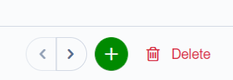

# SilverStripe Cms Actions module

[](https://travis-ci.com/lekoala/silverstripe-cms-actions/)
[](https://scrutinizer-ci.com/g/lekoala/silverstripe-cms-actions/)
[](https://codecov.io/gh/lekoala/silverstripe-cms-actions)

## NEW in 1.2

- Progressive actions!


## Intro

For those of you missing betterbuttons :-) Because let's face it, adding custom actions in SilverStripe is a real pain.

## How does it work ?

Well it's actually quite simple. First of all, we improve the `GridFieldItemRequest` with our `ActionsGridFieldItemRequest`.
This is heavily inspired by betterbuttons module. Thanks to this extension, our actions defined in `getCMSActions` will appear properly.

Then, we forward our requests to the model (a button declared on Member call the ItemRequest handler which forwards the action to the Member model).

We can declare things in two functions:
- As actions in getCMSActions : these are displayed next to the regular "save" button


- As utilities in getCMSUtils : these are displayed on the top right corner, next to the tabs


## LeftAndMain support

This module is mainly targeted at dealing with actions on regular DataObjects. However, in order to support actions on pages, the `ActionsGridFieldItemRequest`
is also applied on `LeftAndMain`. Therefore, actions defined on pages should work properly as well.

WARNING : this is still a bit experimental even if early tests show that this work well.

## Add your buttons

### Actions

Simply use getCMSActions on your DataObjects and add new buttons for your DataObjects!
For this, simply push new actions. The CustomAction class is responsible of calling the
action defined on your DataObject.

In the following example, we call doCustomAction. The return string is displayed as a notification.
If not return string is specified, we display a generic message "Action {action} done on {record}".

```php
public function getCMSActions()
{
    $actions = parent::getCMSActions();

    $actions->push(new CustomAction("doCustomAction", "My custom action"));

    return $actions;
}

public function doCustomAction() {
    return 'Done!';
}
```

If it throws an exception or return a false bool, it will show an error message

```php
public function doCustomAction() {
    throw new Exception("Show this error");
    return false;
}
```

You can set icon. See SilverStripeIcons class for available icons. We use base silverstripe icons.

```php
$downloadExcelReport->setButtonIcon(SilverStripeIcons::ICON_EXPORT);
```

CustomActions are buttons and submitted through ajax. If it changes the state of your record you
may need to refresh the UI, but be careful of not losing any unsaved data.

```php
$myAction->setShouldRefresh(true);
```

Sometimes, you don't want buttons, but links. Use CustomLink instead. This is useful to, say,
download an excel report or a pdf file.

```php
public function getCMSActions()
{
    $actions = parent::getCMSActions();

    $actions->push($downloadExcelReport = new CustomLink('downloadExcelReport','Download report'));
    $downloadExcelReport->setButtonIcon(SilverStripeIcons::ICON_EXPORT);

    return $actions;
}

public function downloadExcelReport() {
    echo "This is the report";
    die();
}
```

Please note that are we use a die pattern that is not very clean, but you can very well return
a HTTPResponse object instead.

CustomLink use by default ajax navigation. You can use `setNoAjax(true)` to prevent this.
CustomLink can open links in a new window. You can use `setNewWindow(true)` to enable this.
CustomLink calls by default an action on the model matching its name. But really you can point it to anything, even an external link using `setLink('https//www.silverstripe.org')`.

#### Confirm actions

If an action is potentially dangerous or avoid misclicks, you can set a confirmation message using `setConfirmation('Are you sure')` or simply pass `true` for a generic message.

### Utils

Declare getCMSUtils or use updateCMSUtils in your extensions. These utilities will
appear next to the tabs. They are ideal to provide some extra information or navigation.
I've used these to add shortcuts, timers, dropdowns navs...

```php
public function getCMSUtils()
{
    $fields = new FieldList();
    $fields->push(new LiteralField("LastLoginInfo", "Last login at " . $this->LastLogin));
    return $fields;
}
```

### Save and close

Add a default "save and close" or "create and close" button to quickly add DataObjects.

This feature can be disabled with the `enable_save_close` config flag


### Delete action is on the right

Really I don't know who thought that having delete button next to a save button was a good idea, but I'd rather have it on the right end side.

This feature can be disabled with the `enable_delete_right` config flag



### Prev/next support

SilverStripe 4.4 introduced a more refined UI for prev/next records. However, it only allows
navigation and does not support "save and next" or "previous and next" which is useful
when you edit records in a row.

This feature can be disabled with the `enable_save_prev_next` config flag


You can also use the HasPrevNextUtils trait to add navigation in your utils as well.

### Custom prev/next record

By implementing PrevRecord and NextRecord and your DataObject, you can override the
default logic provided by SilverStripe.

Prev/next records can be tricky to manage, if you have grid state issues, using nested
gridfields and stuff like that. Using PrevRecord and NextRecord provide a simple mean
without dealing with state problems.

## Adding actions to a GridField row

You can create new row actions by extending the `GridFieldRowButton`

All actions will be stored in a new "Actions" column that supports multiple actions.
This can be used, for example, to download files, like invoices, etc directly from a GridField.

For example, you can do this:

```php
class MyRowAction extends GridFieldRowButton
{
    protected $fontIcon = 'torso';

    public function getActionName()
    {
        return 'my_action';
    }

    public function getButtonLabel()
    {
        return 'My Action';
    }

    public function doHandle(GridField $gridField, $actionName, $arguments, $data)
    {
        $item = $gridField->getList()->byID($arguments['RecordID']);
        if (!$item) {
            return;
        }
        // Do something with item
        // Or maybe download a file...
        return Controller::curr()->redirectBack();
    }
}
```

And use it in your ModelAdmin like so:

```php
public function getGridFieldFrom(Form $form)
{
    return $form->Fields()->dataFieldByName($this->getSanitisedModelClass());
}

public function getEditForm($id = null, $fields = null)
{
    $form = parent::getEditForm($id, $fields);

    $gridfield = $this->getGridFieldFrom($form);

    if ($this->modelClass == MyModel::class) {
        $gridfield->getConfig()->addComponent(new MyRowAction());
    }

    return $form;
}
```

## Adding links to GridField

If actions are not your cup of tea, you can also add links to your GridField.

Again, it will be added to the Actions column.

This acts like a CustomLink describe above, so if we go back to our report example, we get this:

```php
$gridfield->getConfig()->addComponent(new GridFieldCustomLink('downloadExcelReport', 'Download Report'));
```


For security reasons, the action MUST be declared in getCMSActions. Failing to do so will return a
helpful error message. If you do not want to display the button in the detail form, simply
set a d-none on it:

```php
$actions->push($downloadExcelReport = new CustomLink('downloadExcelReport', 'Download report'));
$downloadExcelReport->addExtraClass('d-none');
```

## Adding buttons to a whole GridField

This is done using GridFieldTableButton

```php
class MyGridButton extends GridFieldTableButton
{
    protected $buttonLabel = 'Do stuff';
    protected $fontIcon = 'do_stuff';

    public function handle(GridField $gridField, Controller $controller)
    {
    }
}
```

This class can then be added as a regular GridField component

## Adding actions in getCmsFields

If you have a lot of actions, sometimes it might make more sense to add it to your cms fields.
I've used this to provide template files for instance that needs to be uploaded.

This is done using the `CmsInlineFormAction` class. Please note that the `doCustomAction` function must be declared on your controller, not on the model.

This is due to the fact that we are not submitting the form, therefore we are not processing the record with our `ActionsGridFieldItemRequest`.

```php
public function getCMSFields()
{
    $fields = parent::getCMSFields();

    $fields->addFieldToTab('Root.Actions', new CmsInlineFormAction('doCustomAction', 'Do this'));

    return $fields;
}
```

In your admin class

```php
// don't forget to add me to allowed_actions as well
function doCustomAction()
{
    // do something here
    return $this->redirectBack();
}
```

## Show messages instead of actions

If an action is not available/visible, the user may wonder why. Obviously you can display a disabled button, but you can also
display a message instead of the button. This can be done like so:

```php
$actions->push(LiteralField::create('MyCustomAction', "<span class=\"bb-align\">Action not available</span>"));
```

The `bb-align` class ensure the text is properly aligned with the buttons.

## Extensions support

If your extensions depend on this module, you can play with `DataObject::onBeforeUpdateCMSActions` and `DataObject::onAfterUpdateCMSActions` extension hook to add your own buttons.
This is called after all buttons have been defined.

See for instance how it's done in my [softdelete module](https://github.com/lekoala/silverstripe-softdelete).

## Tab tracking

This extension will also track the active tab when you call save and next / prev and next. This allows editing stuff in a row and keep the same tab.

When clicking on the main tabs, it will also update the url. This way, when you reload the page, the good tab will reopen.

This also allows targeting specific pages with a given tab with links.

## Profile and LeftAndMain extension support

Since we apply our extension on `SilverStripe\Admin\LeftAndMain` actions declared in updateCMSActions/getCMSActions are visible in the profile for example.

The issue here is that the `updateItemEditForm` is never called (this is only called by `GridFieldDetailForm_ItemRequest`, so when you are in a GridField item... in ModelAdmin for instance).

For instance, this means that you actions are displayed before the 'save' button provided by the Profile controller. Currently, this module fixes this with a bit of css.

## Progressive actions

Since version 1.2, this module supports progressive actions. Progressive actions are buttons that use a progress bar to display what is happening. Under the hood,
it translates to multiple ajax calls to the same handler function and passing the following post parameters:

- progress_step: the current step
- progress_total: this can be either set in advance or provided by the handler function


Progressive actions are supported for `GridFieldTableButton` and `CustomLink`.

Here is a sample implementation. The action needs to return an array with the following keys:
- progress_step: the updated step. Usually +1.
- progress_total: the total number of records. It should only be computed once (on the initial run) when none is provided.
- reload: should we reload at the end ?
- message: each run can display a short lived notification with specific text
- label: the end label (by default : Completed).

```php
class MyProgressiveTableButton extends GridFieldTableButton
{
    public function __construct($targetFragment = "buttons-before-right", $buttonLabel = null)
    {
        $this->progressive = true;
        parent::__construct($targetFragment, $buttonLabel);
    }

    public function handle(GridField $gridField, Controller $controller)
    {
        $step = (int) $controller->getRequest()->postVar("progress_step");
        $total = (int) $controller->getRequest()->postVar("progress_total");
        if (!$total) {
            $total = $list->count();
        }
        $i = 0;
        $res = null;
        foreach ($list as $rec) {
            if ($i < $step) {
                $i++;
                continue;
            }
            $res = "Processed record $i";
            break;
        }
        $step++;
        return [
            'progress_step' => $step,
            'progress_total' => $total,
            'reload' => true,
            'message' => $res,
        ];
    }
}
```

## Todo

- Explore pages or siteconfig support
- Mobile ui for utils / Group many buttons into drop
- Svg icons?

## Sponsored by

This module is kindly sponsored by [RESTRUCT](restruct.nl)

## Compatibility

Tested with 4.6 but should work on any ^4.4 projects

## Maintainer

LeKoala - thomas@lekoala.be
